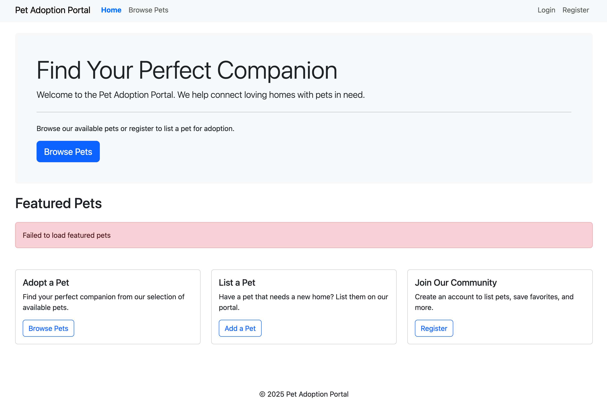

---

# ✅ Step-by-Step Part 1: Create Public S3 Bucket for Static Website Hosting
### 🔹 1. **Create the S3 Bucket**

1. Go to the S3 console: [https://s3.console.aws.amazon.com/s3](https://s3.console.aws.amazon.com/s3)
2. Click **Create bucket**
3. Set:
   - **Bucket name**: `pet-adoption-frontend-origin`
   - **Region**: `us-east-2` (Ohio)
4. ⚠️ **Uncheck**: "Block all public access"
   - Acknowledge the warning
1. Click **Create bucket**
### 🔹 2. **Enable Static Website Hosting**

1. Open the bucket
2. Go to the **Properties** tab
3. Scroll to **Static website hosting**
4. Click **Edit**
   - Enable hosting: ✅ **Enabled**
   - Hosting type: **Bucket Hosting**
   - Index document: `index.html`
   - Error document: `index.html` 
1. Click **Save changes**

### 🔹 3. **Set Public Read Bucket Policy**

Go to the **Permissions** tab → **Bucket policy** → Click **Edit**, then paste:

```json
{
  "Version": "2012-10-17",
  "Statement": [
    {
      "Sid": "AllowPublicRead",
      "Effect": "Allow",
      "Principal": "*",
      "Action": "s3:GetObject",
      "Resource": "arn:aws:s3:::pet-adoption-frontend-origin/*"
    }
  ]
}
```

1. Click **Save changes**

### 🔹 4. **Upload Your Static files**

Follow these [Instructions - site build](https://github.com/gcziprusz/obsidian-notes/blob/main/Continuing%20ED%20NSS/Cloud/Workshop%201/Instructions%20-%20site%20build.md) to build and upload your site then resume here!

### 🔹 5. **Test Your Website**

From the **Properties** tab, scroll to **Static website hosting** and copy the URL:

```
http://pet-adoption-frontend-origin.s3-website-us-east-2.amazonaws.com
```

> This URL http://pet-adoption-frontend-origin.s3-website-us-east-2.amazonaws.com  is for **testing purposes only**. Please do **not bookmark, use, or share** this S3 URL.  It’s simply the raw link to your S3-hosted site.
> 
> Continue following the steps below to learn the **correct way to access your site** through CloudFront, and refer to the table at the bottom of to understand **why using the S3 URL directly is not recommended**.

✅ Open this URL in your browser — your should see:



If you instead see a 404 page below, you likely didn't build and upload your static site correctly, talk to the instructor!


---

# ✅ Step-by-Step Part 2: Create a CloudFront Distribution for Your S3-Hosted Site

### 🔹 1. Go to the CloudFront Console

- Visit [https://console.aws.amazon.com/cloudfront](https://console.aws.amazon.com/cloudfront)
- Click **Create Distribution**
### 🔹 2. Configure the Origin

- **Origin domain**: Select your S3 bucket. Make sure to pick the one **ending in `.s3-website-us-east-2.amazonaws.com`** if you're using S3 static website hosting mode.
- **Origin access control settings**: 
  - Your bucket is public, **no OAC is needed**

### 🔹 3. Set Default Behavior

- **Viewer Protocol Policy**: `Redirect HTTP to HTTPS`
- **Allowed HTTP Methods**: `GET, HEAD`
- **Cache Policy**: Leave as `CachingOptimized` 
- **Compress objects automatically**: ✅ Yes

### 🔹 4. Configure Distribution Settings

- **Price Class**: Choose based on geographic reach (e.g., `Use Only US, Canada and Europe` to reduce cost)
- **Alternate domain name (CNAME)**: Leave blank
- **SSL certificate**: Use default CloudFront SSL unless adding your own domain

Click **Create Distribution**

### 🔹 5. Wait for Distribution to Deploy

- Takes ~5–15 minutes
- You'll get a **Domain Name** like: https://d1swjy5r23w5qr.cloudfront.net

### 🔹 6. Access Your Site via CloudFront

Visit your CloudFront URL listed under the General / Details /  Distribution domain name like:
	https://d1swjy5r23w5qr.cloudfront.net

✅ Your site will now be globally cached and securely served over HTTPS \o/

This is the proper emotion you should feel at this point: 


## ❓ Why Access the Site via CloudFront and Not S3 Directly

| Feature                 | S3 Website URL                    | CloudFront URL                             |
| ----------------------- | --------------------------------- | ------------------------------------------ |
| 🔒 HTTPS secure support | ❌ No                              | ✅ Yes                                      |
| 🚀 Global performance   | ❌ Regional only                   | ✅ Cached at edge locations worldwide       |
| 🔧 Custom domain & SSL  | ❌ Hard to configure               | ✅ Easy                                     |
| 📈 Analytics & logs     | ❌ Limited                         | ✅ Detailed access logs, monitoring options |
| 🎛 Fine-grained control | ❌ Limited headers/caching control | ✅ Full control via Cache/Origin policies   |
| 🔄 Version invalidation | ❌ Manual + slow cache expiration  | ✅ `aws cloudfront create-invalidation`     |

**CloudFront is a CDN (Content Delivery Network)**. It makes your static site:

- Faster for users anywhere in the world
- Served securely via HTTPS
- More customizable and production-ready
