![[DALL·E 2024-11-20 13.13.28 - A whimsical and imaginative depiction of a playful battle between pets and cows. Show a group of pets, including a dog, cat, and parrot, wearing fun, .webp]]

# Monoliths are Pets
- **Single Codebase** All the application components are part of one large codebase.
- **Tightly Coupled** Different parts of the application (e.g., frontend, backend, database) are interdependent.
- **Single Deployment** The entire application is packaged and deployed together as one unit.
- **Easier to Develop Initially** For small teams and applications, monolithic architecture can be quicker to build and deploy.
##### Signs that we have pets
- Named and treated as unique, indispensable instances (like "my-pet-application-web-server")
- Manually configured and maintained
- When sick, they're nursed back to health
- Irreplaceable and require significant effort to recreate
- Example: A traditional monolithic application server that requires careful updates and maintenance
##### Challenges with pets
- **Scalability** Difficult to scale individual components independently.
- **Maintainability** As the codebase grows, it becomes harder to manage and make changes.
- **Slow Development** Small changes require redeploying the entire application.
- **Single Point of Failure** If one part of the application fails, the entire system may be affected.

# Microservices are cattle
- **Independent Services** Each service is self-contained and focuses on a single business capability (e.g., user authentication, tweet processing).
- **Loose Coupling** Services communicate via APIs, making them loosely coupled and independent.
- **Independent Deployment** Each service can be deployed and updated independently of others.
- **Scalability** Each service can be scaled individually based on its own demand.
##### Signs that we have cattle
- Numbered, not named (like "web-server-042")
- Automatically provisioned and configured
- When sick, they're terminated and replaced
- Easily replaceable through automation
- Low maintenance cost per instance
- Example: Auto-scaled microservices in Kubernetes pods / AWS
##### Benefits
- **Flexibility** Enables the use of different technologies for different services.
- **Scalability** Services can be scaled independently to handle varying loads.
- **Faster Development** Teams can work on separate services, speeding up the development process.
- **Fault Isolation** A failure in one service doesn't necessarily affect others.
##### Challenges of Microservices
- **Complexity** More services mean more moving parts to manage.
- **Communication Overhead** Managing interactions between services can be challenging, especially with network latency.
- **Data Consistency** Ensuring data consistency across services requires careful planning.

## From pet owners to ranchers
What questions do we need to ask and answer on our journey from pet owners to ranchers? 

- Where are the Service Boundaries?
- What about Data Management and Consistency?
- How are Services Communicating with each other?
- How are we deploying each piece?
- How do we monitor and observ our services?
- How do the service discover each other?
- How do we secure everything?
- What about Error Handling and Resilience?
- How do we manage Versioning and Backward Compatibility?
- What about the Cost and Infrastructure Complexity?

### Monoliths & Microservices

![[ms 1.webp]]

### Moving towards the right

#### DEMO TWITTER APP
https://github.com/gcziprusz/twitter-microservice-demo

### Demo Twitter Monolith

```mermaid
flowchart TD

A[Twitter - User Functionality, Tweet Functionality, Timeline Functionality - Python 🐍]

E[Browser/Client]

E -->|HTTP timeline/posts| A[Twitter - User Functionality, Tweet Functionality, Timeline Functionality - Python 🐍]

E -->|HTTP /register| A[Twitter - User Functionality, Tweet Functionality, Timeline Functionality - Python 🐍]

E -->|HTTP /tweets | A[Twitter - User Functionality, Tweet Functionality, Timeline Functionality - Python 🐍]

  

style A fill:#ddd,stroke:#333,stroke-width:2px
```

### Demo Twitter Microservices

```mermaid
flowchart TD

A[User Service Container - JavaScript 💛] -->|HTTP| B[Tweet Service Container - Python 🐍]

A -->|HTTP| C[Timeline Service Container - Java ☕]

B -->|HTTP| C

A -.->|RabbitMQ| D[Message Queue 🐰]

B -.->|RabbitMQ| D

C -.->|RabbitMQ| D

E[Browser/Client]

subgraph Docker

A

B

C

D[RabbitMQ Container 🐰]

end

E -->|HTTP timeline/posts| C[Timeline Service Container - Java ☕]

E -->|HTTP /register| B[User Service Container - JavaScript 💛]

E -->|HTTP /tweets | A[Tweet Service Container - Python 🐍]

  

style A fill:#ddd,stroke:#333,stroke-width:2px

style B fill:#9df,stroke:#333,stroke-width:2px

style C fill:#9f9,stroke:#333,stroke-width:2px

style D fill:#ff9,stroke:#333,stroke-width:2px
```

### REFERENCES
https://medium.com/startlovingyourself/microservices-vs-monolithic-architecture-c8df91f16bb4

https://x.com/pvergadia/status/1613591733606174721

### Latency 
[latency source](https://gist.github.com/jboner/2841832?permalink_comment_id=3407006#gistcomment-3407006)